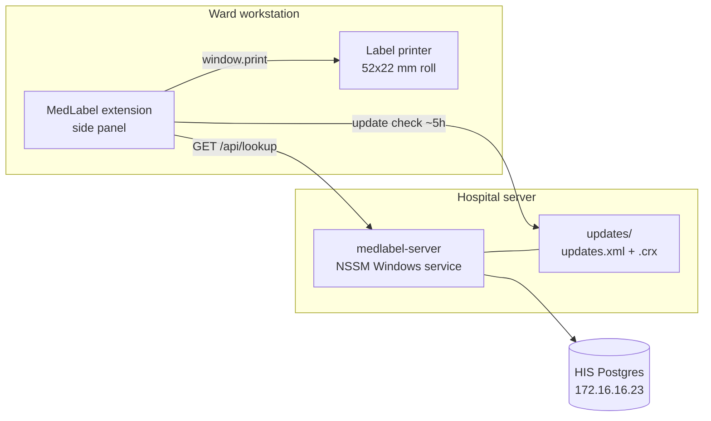

# MedLabel Architecture

## Components

| Repo                          | Owns                                                                                                   |
| ----------------------------- | ------------------------------------------------------------------------------------------------------ |
| `medlabel-server` (this repo) | HIS queries, HTTP API, the API contract, hosting update files, Windows service + Chrome policy scripts |
| `medlabel-extension`          | Side panel UI, which routes become labels, label layout, printing, options page, packaging and signing |

## Responsibilities

- **Only the server talks to Postgres.** Credentials live in the server `.env`. Anything shipped in the extension is readable by anyone who unzips the `.crx`.
- **Only the client prints.** Label printers are attached locally through the Windows driver; the server returns data, never documents.
- **The label layout lives in the extension** (`src/lib/labels.ts`). Changing it needs an extension release. If the template starts changing often, move it behind a server endpoint so edits take effect without a release.
- **Route filtering lives in the extension** (`src/lib/routes.ts`). The server returns every active medication line. An injection is a route that starts with "Tiêm" and does not contain "truyền". An infusion is a route that contains "truyền". Oral lines, including a traditional-medicine thang, come back in the JSON and are not printed.

## Lookup

Implementation: [`src/db/lookup.ts`](../src/db/lookup.ts). If this section and that file disagree, the code wins.

1. Resolve one `his_patienthistory` row (`isdeleted = 'N'`, `isactive = 'Y'`).
   - Mã hồ sơ matches `his_patientdocument` only. The column is unique, so `matchCount` is 1. A 10-digit code must be `YYMMDD` + sequence; the response adds `dateHint` (`YYYY-MM-DD`).
   - Mã bệnh án matches `his_medicalrecordno`. Several encounters can share it. The response is the latest by `timegoin`, and `matchCount` is how many rows matched. There is no index on that column, so this lookup can seq-scan.
2. Load `his_service_product` for that encounter, joined to `his_product` (name), `his_methoduse` (route), `his_dosage` (usage text), and `c_uom` (unit). Ordered by `docdate`, `actdate`, `seqno`. No date window, no route predicate, no dispense (`isverified`) filter.
3. In memory, attach accompanying drugs: `ref_service_union_id` points at the main line's `his_service_union_id` (one level). An orphan reference stays a standalone line. Group lines into tờ điều trị by `createdfromrecord_id`; orders are newest first.

The pool is at most 4 connections, 10 s to connect, 30 s idle ([`src/db/pool.ts`](../src/db/pool.ts)). Every connection sets Postgres `statement_timeout` (`STATEMENT_TIMEOUT_MS`, default 8 s) so a slow HIS query cannot hold a pool slot indefinitely. Idle client errors are logged and do not crash the process. Each HTTP request has a wall-clock timeout (`REQUEST_TIMEOUT_MS`, default 10 s); on SIGTERM/SIGINT the server stops accepting work, drains in-flight requests up to `SHUTDOWN_DRAIN_MS`, then closes the pool. Lookup requests log one line: `lookup ms=… status=… by=… ip=…`. The rate limit keys on the socket address and ignores `X-Forwarded-For`.

### What each label actually prints

The API returns more fields than the roll uses. Ward, bed, gender, quantity, and `tocDoTruyen` are in the HIS and in the JSON; they are not on the current template.

| Label                                                 | Printed fields                                                                                                                                                                                               |
| ----------------------------------------------------- | ------------------------------------------------------------------------------------------------------------------------------------------------------------------------------------------------------------ |
| Injection, 52×22 mm, two per row                      | Drug name, accompanying-drug names (`thuocDungKem`), patient name, age, mã bệnh án. An odd last slot stays blank.                                                                                            |
| Infusion, one drug per row (patient half + drug half) | Left (1/2): patient name, birth year, a blank nurse line, print time. Right (2/2): drug name, accompanying-drug names, `lieuDung` as the rate. Both halves show the same 1-based pair number and mã bệnh án. |

One print of a phiếu is a single window: injection rows first, then infusion rows. Pair numbers restart at 1 for that job, including a reprint of one infusion. Printing only one kind is the same window with the other section omitted.

`lieuDung` is `his_service_product.his_usage`, not `transferrate`. Changing which column means "tốc độ" is an extension change.

## API contract across two repos

The repos cannot share imports, and a silent shape mismatch would surface as a wrong label on a syringe. Three layers prevent that:

1. `src/contracts/lookup.v1.ts` here is the source of truth. It has no imports.
2. The extension copies it with `yarn sync:contract`. The copy carries a sha256 header; `yarn check:contract` (pre-commit) fails if someone edits the copy by hand.
3. Every response includes `apiVersion`. The extension refuses to render or print when it differs from its own version, and shows an error telling staff to contact IT.

## Updates

- **Server changes** (queries, validation) take effect on service restart. Every workstation sees them immediately.
- **Extension changes** ship as a signed `.crx`. Chrome polls `update_url` (`http://medlabel.local:8080/updates.xml`) roughly every 5 hours and installs a higher version automatically. `updates.xml` is sent with `Cache-Control: no-cache`. A `.crx` is `application/x-chrome-extension` and may be cached for a day, so publish the `.crx` before the XML that points at it.

The extension ID is derived from the signing key (`keys/extension.pem` in the extension repo). Losing that key means every workstation needs a reinstall.

## Network naming

Use the DNS name `medlabel.local`, not an IP. The name is baked into `update_url`, the extension's default server origin, and the Chrome policy on every workstation. If the server moves, repoint DNS; nothing on the workstations changes.

Chrome host permission patterns ignore ports, so the manifest declares `http://medlabel.local/*`. A different server set in the options page triggers a one-time permission prompt.
