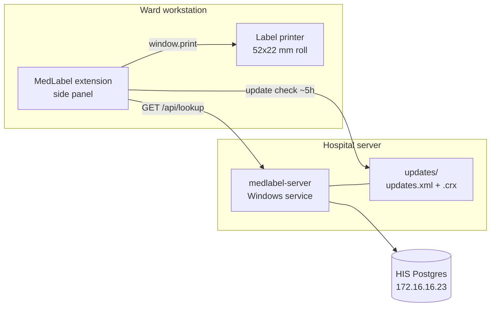

# MedLabel Architecture

## Components

| Repo                          | Owns                                                                                                   |
| ----------------------------- | ------------------------------------------------------------------------------------------------------ |
| `medlabel-server` (this repo) | HIS queries, HTTP API, the API contract, hosting update files, Windows service + Chrome policy scripts |
| `medlabel-extension`          | Side panel UI, label layout, printing, options page, packaging and signing                             |

## Responsibilities

- **Only the server talks to Postgres.** Credentials live in the server `.env`. Anything shipped in the extension is readable by anyone who unzips the `.crx`.
- **Only the client prints.** Label printers are attached locally through the Windows driver; the server returns data, never documents.
- **The label layout lives in the extension** (`src/lib/labels.ts`). Changing it needs an extension release. If the template starts changing often, move it behind a server endpoint so edits take effect without a release.

## API contract across two repos

The repos cannot share imports, and a silent shape mismatch would surface as a wrong label on a syringe. Three layers prevent that:

1. `src/contracts/lookup.v1.ts` here is the source of truth. It has no imports.
2. The extension copies it with `yarn sync:contract`. The copy carries a sha256 header; `yarn check:contract` (pre-commit) fails if someone edits the copy by hand.
3. Every response includes `apiVersion`. The extension refuses to render or print when it differs from its own version, and shows an error telling staff to contact IT.

## Updates

- **Server changes** (queries, validation) take effect on service restart. Every workstation sees them immediately.
- **Extension changes** ship as a signed `.crx`. Chrome polls `update_url` (`http://medlabel.local:8080/updates.xml`) roughly every 5 hours and installs a higher version automatically.

The extension ID is derived from the signing key (`keys/extension.pem` in the extension repo). Losing that key means every workstation needs a reinstall.

## Network naming

Use the DNS name `medlabel.local`, not an IP. The name is baked into `update_url`, the extension's default server origin, and the Chrome policy on every workstation. If the server moves, repoint DNS; nothing on the workstations changes.

Chrome host permission patterns ignore ports, so the manifest declares `http://medlabel.local/*`. A different server set in the options page triggers a one-time permission prompt.
