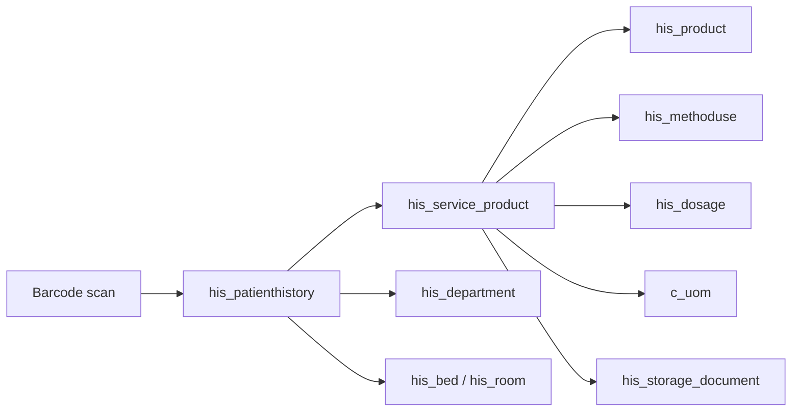

# HIS DB map for MedLabel (infusion labels)

Goal: when a nurse prepares medication, scan a patient barcode → print a syringe/bag label with patient identity, drug name, route, and instructions.

## Recommended data path



**Primary fact table:** `adempiere.his_service_product`  
Each row is a medication (or product) line on a patient encounter (`his_patienthistory_id`), with dosage, route, quantity, infusion rate, and pharmacy/storage linkage.

**Ready-made nursing views** (prefer these when they match the workflow):

| View                              | Role                                                                                                      |
| --------------------------------- | --------------------------------------------------------------------------------------------------------- |
| `nb_phieu_thuc_hien_y_lenh_thuoc` | Medication execution slip — Vietnamese column names, includes route, usage, infusion rate, dispensed flag |
| `his_rv_y_lenh_product`           | Order sheet product lines (methoduse, dosage, transfer rate, drips `giotich`)                             |
| `his_rv_medical_product`          | Similar to y_lenh product; includes evolution link                                                        |
| `his_hsba_medicine`               | Thin projection of `his_service_product` as “HSBA medicine”                                               |

`nb_phieu_thuc_hien_y_lenh_thuoc` is built **from** `his_service_product` joined to `his_product`, `his_methoduse`, `his_dosage`, `c_uom`, and storage docs.

## Entity roles

### Patient / encounter

| Table                                      | Role                             | Label-relevant fields                                                                                                                                                                                                                         |
| ------------------------------------------ | -------------------------------- | --------------------------------------------------------------------------------------------------------------------------------------------------------------------------------------------------------------------------------------------- |
| `his_patient`                              | Master patient (~1.1M)           | `his_patient_id`, `value`, `name`, `birthday`, `his_gender`                                                                                                                                                                                   |
| `his_patienthistory`                       | Encounter / đợt điều trị (~3.5M) | `his_patienthistory_id`, `value`, `name`, `scancode`, `his_patientdocument`, `his_medicalrecordno`, `birthday`, `his_gender`, `his_department_id`, `his_room_id`, `his_bed_id`, `isinpatient`, `ispatientinhospital`, `timegoin`, `timegoout` |
| `his_reception`                            | Registration                     | Also has `scancode`, links `his_patienthistory_id`                                                                                                                                                                                            |
| `his_department`                           | Khoa (79 active)                 | `name`, `value`                                                                                                                                                                                                                               |
| `his_room` / `his_bed` / `his_patient_bed` | Location                         | Bed/room for inpatient labels                                                                                                                                                                                                                 |

**Lookup indexes on encounter:** unique `hph_patientdocument` (mã hồ sơ), `hph_value` (mã NB), name/trigram indexes.  
**No index on `scancode`** was found — confirm scanner payload with IT; if scans use `scancode`, consider requesting an index.

### Mã hồ sơ vs mã NB

Both are often **10 digits** and look similar — do **not** confuse them.

| Concept        | Example shape                               | DB column                                | View alias                  |
| -------------- | ------------------------------------------- | ---------------------------------------- | --------------------------- |
| **Mã hồ sơ**   | `2609230012` = `YYMMDD` + 4-digit daily STT | `his_patienthistory.his_patientdocument` | `nb_to_dieu_tri.ma_ho_so`   |
| **Mã NB**      | also ~10 digits                             | `his_patienthistory.value`               | `nb_to_dieu_tri.ma_nb`      |
| **Mã bệnh án** | variable length (7 digits or `23.HSSKCB.…`) | `his_patienthistory.his_medicalrecordno` | `nb_to_dieu_tri.ma_benh_an` |

Verified: sample `2609230012` matches **only** `his_patientdocument`. Over a recent 3-day window, digit-10 `value` and `his_patientdocument` were **never equal**. Lookup must use `his_patientdocument` exclusively (no fallback to `value`).

**Mã bệnh án** can repeat across multiple encounters. Lookup picks the latest by `timegoin`. There is **no index** on `his_medicalrecordno` → may seq-scan (slower than mã hồ sơ).

CLI (validate data flow):

```bash
yarn lookup --ma-ho-so=2609230012
yarn lookup --ma-benh-an=2641600
```

### Medication order line (core)

| Table                 | Role                             | Label-relevant fields                                                                                                                                                           |
| --------------------- | -------------------------------- | ------------------------------------------------------------------------------------------------------------------------------------------------------------------------------- |
| `his_service_product` | Ordered/used product line        | See below                                                                                                                                                                       |
| `his_product`         | Drug catalog                     | `name`, `originalname`, `value`, `his_measure`, `dosage_form`, `infusionvolume`, `his_methoduse_id`, `his_activeingredient`, `his_producttype_id`, `c_uom_id`, `his_service_id` |
| `his_methoduse`       | Route of administration          | `name` (e.g. Tiêm bắp, Truyền tĩnh mạch)                                                                                                                                        |
| `his_dosage`          | Usage text / regimen             | `name`, `timesperday`, `pillspertime`                                                                                                                                           |
| `his_product_dosage`  | Default dosage ↔ product/service | `his_dosage_id`, `his_service_id`                                                                                                                                               |
| `his_producttype`     | Classification                   | Includes **Dịch truyền**, kháng sinh, gây nghiện, …                                                                                                                             |
| `c_uom`               | Unit of measure                  | `name`, `uomsymbol`                                                                                                                                                             |
| `his_danhmuc_thuoc`   | BHYT drug catalog subset         | `ma_thuoc`, `ten_thuoc`, `ten_hoat_chat`, `duong_dung`, `ham_luong`                                                                                                             |

#### Important `his_service_product` columns

| Column                                                 | Meaning for labels                                                                    |
| ------------------------------------------------------ | ------------------------------------------------------------------------------------- |
| `his_service_product_id`                               | Line id                                                                               |
| `his_patienthistory_id`                                | Encounter                                                                             |
| `patientname` / `patientvalue`                         | Denormalized patient                                                                  |
| `his_service_id`                                       | Links to `his_product.his_service_id`                                                 |
| `servicename` / `value`                                | Line name / code                                                                      |
| `his_dosage_id`                                        | → `his_dosage.name` (cách dùng)                                                       |
| `his_methoduse_id`                                     | → `his_methoduse.name` (đường dùng)                                                   |
| `his_usage`                                            | Free-text dose/usage (`lieu_dung` in nursing view)                                    |
| `quantity` / `requestedquantity`                       | Qty                                                                                   |
| `transferrate`                                         | Infusion rate (`toc_do_truyen`)                                                       |
| `transferunit`                                         | Rate unit ref (`ml/h`, `d/m`)                                                         |
| `usedhour` / `fromhour` / `tohour`                     | Timing                                                                                |
| `timesperday` / `numberofday` / `useddayquantity`      | Frequency / days                                                                      |
| `docdate` / `actdate`                                  | Order / act timestamps                                                                |
| `isinpatient`                                          | Inpatient flag                                                                        |
| `isdrugstore`                                          | Pharmacy (nhà thuốc) vs ward stock                                                    |
| `his_storage_document_id` / `batchdist_storage_doc_id` | Dispense / distribution docs                                                          |
| `from_department_id` / `from_doctor_id`                | Ordering dept / doctor                                                                |
| `his_producttype_id`                                   | Product class                                                                         |
| `note`                                                 | Free note                                                                             |
| `isdeleted` / `isactive`                               | Soft flags                                                                            |
| `his_service_union_id`                                 | Business id of the line (unique index `hsp_serviceunionid`)                           |
| `ref_service_union_id`                                 | Points at the main line's `his_service_union_id` when this row is a solvent / co-drug |

Indexes useful for MedLabel: `hsp_patienthistoryid`, `hsp_actdate`, `hsp_storagedocumenetid`, `hsp_batchdiststoragedocid`.  
**No index on `ref_service_union_id`.** Resolve accompanying drugs in memory after fetching by `his_patienthistory_id`. A SQL self-join on that column scanned the whole table (~4 minutes for one encounter).

### Thuốc dùng kèm (solvent / co-drug)

HIS models a mixed preparation as sibling rows on the same encounter:

- The **main drug** has `ref_service_union_id IS NULL`.
- Each **accompanying drug** has `ref_service_union_id` = the main line's `his_service_union_id`.

The nursing view `nb_phieu_thuc_hien_y_lenh_thuoc` exposes the same link as `thuoc_dung_kem` (`isreference = 'Y'`) and `thuoc_dung_kem_id` (`ref_service_union_id`). MedLabel keys off `ref_service_union_id`, not `isreference`: the two disagree on a handful of non-medicine lines.

Verified constraints (recent 3-day window):

- The link is **one level**. An accompanying line never points at another accompanying line.
- One main line has at most a few companions for injections (almost always 1, sometimes 2).
- Dose, route text, and infusion rate live on the **main** line. Accompanying lines carry name, quantity, and unit only.
- Traditional-medicine formulas reuse the same columns for a whole thang (13–18 herbs, route `Uống`). Injection labels ignore them because the route filter excludes oral lines.
- Do not filter to `createdfromservicetype = 'MedicalRecordLine'`. That source exists only for inpatients. Outpatient medicine is `CheckUp` / `Document`, and intraoperative medicine is `Surgery`.

### Pharmacy / dispense

| Table                      | Role                                                                                                        |
| -------------------------- | ----------------------------------------------------------------------------------------------------------- |
| `his_prescription`         | Prescription header → `his_patienthistory_id`, `his_storage_document_id`                                    |
| `his_storage_document`     | Inventory document (import/export/dispense); patient fields + `prescriptionno`, `isdrugstore`, `isverified` |
| `his_storage_documentline` | Document lines (qty, product import, service)                                                               |
| `his_storage`              | Warehouse / tủ thuốc (`isdrugstore`, department)                                                            |
| `his_pegging_drugstore`    | Drugstore pegging                                                                                           |

Dispensed flag in nursing view: `da_phat` ⇔ storage document `isverified = 'Y'`.

### Related but secondary

| Object                      | Note                                                  |
| --------------------------- | ----------------------------------------------------- |
| `his_doctoradvice`          | Only 3 template rows — not per-order advice           |
| `his_care` / `his_carecard` | Care regimes / cards — not primary for syringe labels |
| `his_qrcode`                | Payment/QR flows — not patient wristband scan         |
| `m_product` / `c_order*`    | ADempiere ERP core — HIS clinical meds use `his_*`    |

## Suggested query (label payload)

Resolve encounter, then load today’s parenteral lines. Adjust the scan-key column after IT confirms the barcode content.

```sql
-- 1) Resolve encounter (example: by patienthistory.value)
SELECT
  ph.his_patienthistory_id,
  ph.value AS ma_dot,
  ph.name AS ten_nb,
  ph.birthday,
  ph.his_gender,
  ph.his_medicalrecordno,
  ph.his_department_id,
  d.name AS khoa,
  ph.his_room_id,
  ph.his_bed_id
FROM adempiere.his_patienthistory ph
LEFT JOIN adempiere.his_department d
  ON d.his_department_id = ph.his_department_id
WHERE ph.isdeleted = 'N'
  AND ph.isactive = 'Y'
  AND ph.value = $1;   -- or scancode / his_patientdocument

-- 2) Medication lines for labels (injection / infusion routes)
SELECT
  sp.his_service_product_id,
  COALESCE(hp.name, sp.servicename) AS ten_thuoc,
  hp.originalname,
  hp.his_activeingredient AS hoat_chat,
  hp.dosage_form,
  hp.infusionvolume,
  mu.name AS duong_dung,
  dos.name AS cach_dung,
  sp.his_usage AS lieu_dung,
  sp.quantity,
  sp.requestedquantity,
  uom.name AS dvt,
  sp.transferrate AS toc_do_truyen,
  sp.transferunit AS don_vi_toc_do,
  sp.usedhour,
  sp.docdate,
  sp.actdate,
  sp.isdrugstore,
  COALESCE(hsd.isverified, 'N') AS da_xuat_kho
FROM adempiere.his_service_product sp
LEFT JOIN adempiere.his_product hp
  ON hp.his_service_id = sp.his_service_id
LEFT JOIN adempiere.his_methoduse mu
  ON mu.his_methoduse_id = sp.his_methoduse_id
LEFT JOIN adempiere.his_dosage dos
  ON dos.his_dosage_id = sp.his_dosage_id
LEFT JOIN adempiere.c_uom uom
  ON uom.c_uom_id = COALESCE(sp.c_uom_id, hp.c_uom_id)
LEFT JOIN adempiere.his_storage_document hsd
  ON hsd.his_storage_document_id = COALESCE(sp.batchdist_storage_doc_id, sp.his_storage_document_id)
WHERE sp.isdeleted = 'N'
  AND sp.isactive = 'Y'
  AND sp.his_patienthistory_id = $1
  AND sp.docdate::date = CURRENT_DATE   -- or actdate; confirm with nursing
  AND mu.name ~* '(tiêm|truyền)';       -- or filter by his_methoduse_id list
ORDER BY mu.priority NULLS LAST, sp.actdate, sp.seqno;
```

Equivalent nursing-oriented view:

```sql
SELECT *
FROM adempiere.nb_phieu_thuc_hien_y_lenh_thuoc
WHERE nb_dot_dieu_tri_id = $1   -- = his_patienthistory_id
  AND ten_duong_dung ~* '(tiêm|truyền)'
  AND deleted = false;
```

## Label field checklist

| Label area               | Source                                             |
| ------------------------ | -------------------------------------------------- |
| Patient name             | `his_patienthistory.name`                          |
| Patient / encounter code | `value` / `his_patientdocument` / `scancode` (TBD) |
| DOB / gender             | `birthday`, `his_gender`                           |
| Ward / bed               | `his_department`, `his_room`, `his_bed`            |
| Drug name                | `his_product.name` / `servicename`                 |
| Ingredient               | `his_product.his_activeingredient`                 |
| Strength / form          | `dosage_form`, `his_measure`, `infusionvolume`     |
| Route                    | `his_methoduse.name`                               |
| Instructions             | `his_dosage.name` + `his_usage`                    |
| Qty / UOM                | `quantity` + `c_uom.name`                          |
| Infusion rate            | `transferrate` + `transferunit` (`ml/h`, `d/m`)    |
| Time                     | `usedhour` / `actdate`                             |

## Performance guidelines

1. Always bind `his_patienthistory_id` (indexed).
2. Restrict by `docdate` or `actdate` (day window).
3. Avoid `SELECT *` from heavy views without encounter filter.
4. Cache `his_methoduse` / `his_dosage` in the app (tiny tables).

## Next discovery steps

1. Confirm barcode field with a controlled test scan (IT + nursing).
2. Compare one known inpatient’s y lệnh on screen vs `nb_phieu_thuc_hien_y_lenh_thuoc` for the same `his_patienthistory_id`.
3. Decide dispense filter (`da_phat` / `isverified`).
4. Design label template + print path (Zebra/Godex/Windows printer).
