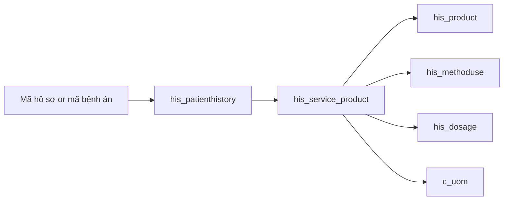

# HIS DB map for MedLabel (infusion labels)

Goal: when a nurse prepares medication, scan a patient barcode → print a syringe/bag label with patient identity, drug name, route, and instructions.

## Recommended data path



Department, bed, and storage documents are on the encounter and the line, but the server does not join them. The extension filters routes after the JSON comes back.

**Primary fact table:** `adempiere.his_service_product`  
Each row is a medication (or product) line on a patient encounter (`his_patienthistory_id`), with dosage, route, quantity, infusion rate, and pharmacy/storage linkage.

**Nursing views** (reference only — the server queries the base tables, not these views):

| View                              | Role                                                                                                      |
| --------------------------------- | --------------------------------------------------------------------------------------------------------- |
| `nb_phieu_thuc_hien_y_lenh_thuoc` | Medication execution slip — Vietnamese column names, includes route, usage, infusion rate, dispensed flag |
| `his_rv_y_lenh_product`           | Order sheet product lines (methoduse, dosage, transfer rate, drips `giotich`)                             |
| `his_rv_medical_product`          | Similar to y_lenh product; includes evolution link                                                        |
| `his_hsba_medicine`               | Thin projection of `his_service_product` as “HSBA medicine”                                               |

`nb_phieu_thuc_hien_y_lenh_thuoc` is built **from** `his_service_product` joined to `his_product`, `his_methoduse`, `his_dosage`, `c_uom`, and storage docs.

## Entity roles

### Patient / encounter

| Table                                      | Role                             | Label-relevant fields                                                                                                                                                                                                                         |
| ------------------------------------------ | -------------------------------- | --------------------------------------------------------------------------------------------------------------------------------------------------------------------------------------------------------------------------------------------- |
| `his_patient`                              | Master patient (~1.1M)           | `his_patient_id`, `value`, `name`, `birthday`, `his_gender`                                                                                                                                                                                   |
| `his_patienthistory`                       | Encounter / đợt điều trị (~3.5M) | `his_patienthistory_id`, `value`, `name`, `scancode`, `his_patientdocument`, `his_medicalrecordno`, `birthday`, `his_gender`, `his_department_id`, `his_room_id`, `his_bed_id`, `isinpatient`, `ispatientinhospital`, `timegoin`, `timegoout` |
| `his_reception`                            | Registration                     | Also has `scancode`, links `his_patienthistory_id`                                                                                                                                                                                            |
| `his_department`                           | Khoa (79 active)                 | `name`, `value`                                                                                                                                                                                                                               |
| `his_room` / `his_bed` / `his_patient_bed` | Location                         | Bed/room for inpatient labels                                                                                                                                                                                                                 |

**Lookup indexes on encounter:** unique `hph_patientdocument` (mã hồ sơ), `hph_value` (mã NB), name/trigram indexes.  
**No index on `scancode` or `his_medicalrecordno`.** MedLabel does not query `scancode`. Mã bệnh án lookup can seq-scan; see [HIS_DB_OVERVIEW.md](HIS_DB_OVERVIEW.md).

### Mã hồ sơ vs mã NB

Both are often **10 digits** and look similar — do **not** confuse them.

| Concept        | Example shape                               | DB column                                | View alias                  |
| -------------- | ------------------------------------------- | ---------------------------------------- | --------------------------- |
| **Mã hồ sơ**   | `2609230012` = `YYMMDD` + 4-digit daily STT | `his_patienthistory.his_patientdocument` | `nb_to_dieu_tri.ma_ho_so`   |
| **Mã NB**      | also ~10 digits                             | `his_patienthistory.value`               | `nb_to_dieu_tri.ma_nb`      |
| **Mã bệnh án** | variable length (7 digits or `23.HSSKCB.…`) | `his_patienthistory.his_medicalrecordno` | `nb_to_dieu_tri.ma_benh_an` |

Verified: sample `2609230012` matches **only** `his_patientdocument`. Over a recent 3-day window, digit-10 `value` and `his_patientdocument` were **never equal**. Lookup must use `his_patientdocument` exclusively (no fallback to `value`).

**Mã bệnh án** can repeat across multiple encounters. Lookup picks the latest by `timegoin`. There is **no index** on `his_medicalrecordno` → may seq-scan (slower than mã hồ sơ).

CLI (validate data flow):

```bash
yarn lookup --ma-ho-so=2609230012
yarn lookup --ma-benh-an=2641600
```

### Medication order line (core)

| Table                 | Role                             | Label-relevant fields                                                                                                                                                           |
| --------------------- | -------------------------------- | ------------------------------------------------------------------------------------------------------------------------------------------------------------------------------- |
| `his_service_product` | Ordered/used product line        | See below                                                                                                                                                                       |
| `his_product`         | Drug catalog                     | `name`, `originalname`, `value`, `his_measure`, `dosage_form`, `infusionvolume`, `his_methoduse_id`, `his_activeingredient`, `his_producttype_id`, `c_uom_id`, `his_service_id` |
| `his_methoduse`       | Route of administration          | `name` (e.g. Tiêm bắp, Truyền tĩnh mạch)                                                                                                                                        |
| `his_dosage`          | Usage text / regimen             | `name`, `timesperday`, `pillspertime`                                                                                                                                           |
| `his_product_dosage`  | Default dosage ↔ product/service | `his_dosage_id`, `his_service_id`                                                                                                                                               |
| `his_producttype`     | Classification                   | Includes **Dịch truyền**, kháng sinh, gây nghiện, …                                                                                                                             |
| `c_uom`               | Unit of measure                  | `name`, `uomsymbol`                                                                                                                                                             |
| `his_danhmuc_thuoc`   | BHYT drug catalog subset         | `ma_thuoc`, `ten_thuoc`, `ten_hoat_chat`, `duong_dung`, `ham_luong`                                                                                                             |

#### Important `his_service_product` columns

| Column                                                 | Meaning for labels                                                                    |
| ------------------------------------------------------ | ------------------------------------------------------------------------------------- |
| `his_service_product_id`                               | Line id                                                                               |
| `his_patienthistory_id`                                | Encounter                                                                             |
| `patientname` / `patientvalue`                         | Denormalized patient                                                                  |
| `his_service_id`                                       | Links to `his_product.his_service_id`                                                 |
| `servicename` / `value`                                | Line name / code                                                                      |
| `his_dosage_id`                                        | → `his_dosage.name` (cách dùng)                                                       |
| `his_methoduse_id`                                     | → `his_methoduse.name` (đường dùng)                                                   |
| `his_usage`                                            | Free-text dose/usage (`lieu_dung` in nursing view)                                    |
| `quantity` / `requestedquantity`                       | Qty                                                                                   |
| `transferrate`                                         | Infusion rate (`toc_do_truyen`)                                                       |
| `transferunit`                                         | Rate unit ref (`ml/h`, `d/m`)                                                         |
| `usedhour` / `fromhour` / `tohour`                     | Timing                                                                                |
| `timesperday` / `numberofday` / `useddayquantity`      | Frequency / days                                                                      |
| `docdate` / `actdate`                                  | Order / act timestamps                                                                |
| `isinpatient`                                          | Inpatient flag                                                                        |
| `isdrugstore`                                          | Pharmacy (nhà thuốc) vs ward stock                                                    |
| `his_storage_document_id` / `batchdist_storage_doc_id` | Dispense / distribution docs                                                          |
| `from_department_id` / `from_doctor_id`                | Ordering dept / doctor                                                                |
| `his_producttype_id`                                   | Product class                                                                         |
| `note`                                                 | Free note                                                                             |
| `isdeleted` / `isactive`                               | Soft flags                                                                            |
| `his_service_union_id`                                 | Business id of the line (unique index `hsp_serviceunionid`)                           |
| `ref_service_union_id`                                 | Points at the main line's `his_service_union_id` when this row is a solvent / co-drug |

Indexes useful for MedLabel: `hsp_patienthistoryid`, `hsp_actdate`, `hsp_storagedocumenetid`, `hsp_batchdiststoragedocid`.  
**No index on `ref_service_union_id`.** Resolve accompanying drugs in memory after fetching by `his_patienthistory_id`. A SQL self-join on that column scanned the whole table (~4 minutes for one encounter).

### Thuốc dùng kèm (solvent / co-drug)

HIS models a mixed preparation as sibling rows on the same encounter:

- The **main drug** has `ref_service_union_id IS NULL`.
- Each **accompanying drug** has `ref_service_union_id` = the main line's `his_service_union_id`.

The nursing view `nb_phieu_thuc_hien_y_lenh_thuoc` exposes the same link as `thuoc_dung_kem` (`isreference = 'Y'`) and `thuoc_dung_kem_id` (`ref_service_union_id`). MedLabel keys off `ref_service_union_id`, not `isreference`: the two disagree on a handful of non-medicine lines.

Verified constraints (recent 3-day window):

- The link is **one level**. An accompanying line never points at another accompanying line.
- One main line has at most a few companions for injections (almost always 1, sometimes 2).
- Dose, route text, and infusion rate live on the **main** line. Accompanying lines carry name, quantity, and unit only.
- Traditional-medicine formulas reuse the same columns for a whole thang (13–18 herbs, route `Uống`). The server returns those rows. The extension does not print them, because the route is neither an injection nor an infusion.
- Do not filter to `createdfromservicetype = 'MedicalRecordLine'`. That source exists only for inpatients. Outpatient medicine is `CheckUp` / `Document`, and intraoperative medicine is `Surgery`. The server does not filter this column.

### Pharmacy / dispense

| Table                      | Role                                                                                                        |
| -------------------------- | ----------------------------------------------------------------------------------------------------------- |
| `his_prescription`         | Prescription header → `his_patienthistory_id`, `his_storage_document_id`                                    |
| `his_storage_document`     | Inventory document (import/export/dispense); patient fields + `prescriptionno`, `isdrugstore`, `isverified` |
| `his_storage_documentline` | Document lines (qty, product import, service)                                                               |
| `his_storage`              | Warehouse / tủ thuốc (`isdrugstore`, department)                                                            |
| `his_pegging_drugstore`    | Drugstore pegging                                                                                           |

Dispensed flag in nursing view: `da_phat` ⇔ storage document `isverified = 'Y'`.

### Related but secondary

| Object                      | Note                                                  |
| --------------------------- | ----------------------------------------------------- |
| `his_doctoradvice`          | Only 3 template rows — not per-order advice           |
| `his_care` / `his_carecard` | Care regimes / cards — not primary for syringe labels |
| `his_qrcode`                | Payment/QR flows — not patient wristband scan         |
| `m_product` / `c_order*`    | ADempiere ERP core — HIS clinical meds use `his_*`    |

## Query the server runs

Shaping (accompanying drugs, tờ điều trị groups, `matchCount`) is in TypeScript after these statements. The code in [`src/db/lookup.ts`](../src/db/lookup.ts) wins if it drifts from this section.

The server does **not** restrict to `CURRENT_DATE`, does **not** filter `mu.name` to tiêm/truyền, and does **not** join `his_storage_document`. Route selection happens in the extension.

```sql
-- Mã hồ sơ. his_patientdocument is unique, so LIMIT 1 is the row.
SELECT
  his_patienthistory_id, name, birthday, age, birthdaystr, his_gender,
  his_patientdocument, value, his_medicalrecordno
FROM adempiere.his_patienthistory
WHERE his_patientdocument = $1
  AND isdeleted = 'N'
  AND isactive = 'Y'
LIMIT 1;

-- Mã bệnh án. Latest encounter; match_count is how many shared the code.
SELECT
  his_patienthistory_id, name, birthday, age, birthdaystr, his_gender,
  his_patientdocument, value, his_medicalrecordno,
  COUNT(*) OVER() AS match_count
FROM adempiere.his_patienthistory
WHERE his_medicalrecordno = $1
  AND isdeleted = 'N'
  AND isactive = 'Y'
ORDER BY timegoin DESC NULLS LAST, his_patienthistory_id DESC
LIMIT 1;

-- Every active line on that encounter.
SELECT
  sp.his_service_product_id,
  sp.createdfromrecord_id,
  sp.his_service_union_id,
  sp.ref_service_union_id,
  COALESCE(hp.name, sp.servicename) AS ten_thuoc,
  sp.his_usage,
  dos.name AS cach_dung,
  mu.name AS duong_dung,
  sp.docdate,
  sp.actdate,
  sp.quantity,
  uom.name AS dvt,
  sp.transferrate,
  sp.transferunit
FROM adempiere.his_service_product sp
LEFT JOIN adempiere.his_product hp
  ON hp.his_service_id = sp.his_service_id
LEFT JOIN adempiere.his_methoduse mu
  ON mu.his_methoduse_id = sp.his_methoduse_id
LEFT JOIN adempiere.his_dosage dos
  ON dos.his_dosage_id = sp.his_dosage_id
LEFT JOIN adempiere.c_uom uom
  ON uom.c_uom_id = COALESCE(sp.c_uom_id, hp.c_uom_id)
WHERE sp.his_patienthistory_id = $1
  AND sp.isdeleted = 'N'
  AND sp.isactive = 'Y'
ORDER BY sp.docdate NULLS LAST, sp.actdate NULLS LAST, sp.seqno NULLS LAST;
```

`nb_phieu_thuc_hien_y_lenh_thuoc` is the nursing-screen equivalent (`nb_dot_dieu_tri_id` = `his_patienthistory_id`). Useful when comparing a phiếu on screen to the API. Do not `SELECT *` from it without that filter.

## Fields the API returns vs fields the label prints

| API field                         | HIS source                                           | On the current label                                               |
| --------------------------------- | ---------------------------------------------------- | ------------------------------------------------------------------ |
| `tenNb`                           | `his_patienthistory.name`                            | Injection and infusion                                             |
| `tuoi`                            | `age`, else computed from `birthday` / `birthdaystr` | Injection only                                                     |
| `ngaySinh`                        | `birthday`                                           | Infusion, as a four-digit birth year                               |
| `maBenhAn`                        | `his_medicalrecordno`                                | Both                                                               |
| `maHoSo` / `maNb`                 | `his_patientdocument` / `value`                      | Not printed                                                        |
| `gioiTinh`                        | `his_gender`                                         | Not printed                                                        |
| `tenThuoc`                        | `his_product.name`, else `servicename`               | Both                                                               |
| `thuocDungKem[].tenThuoc`         | accompanying line name                               | Both, joined with `+`                                              |
| `duongDung`                       | `his_methoduse.name`                                 | Not printed; the extension uses it to choose injection vs infusion |
| `lieuDung`                        | `his_usage`                                          | Infusion only, labeled "Tốc độ"                                    |
| `cachDung`                        | `his_dosage.name`                                    | Not printed                                                        |
| `soLuong` / `dvt`                 | `quantity` / `c_uom.name`                            | Not printed                                                        |
| `tocDoTruyen` / `donViTocDo`      | `transferrate` / `transferunit`                      | Not printed                                                        |
| `thoiGianKe` / `thoiGianThucHien` | `docdate` / `actdate`                                | Not printed; infusion "Thời gian" is the clock at print time       |

Ward, bed, active ingredient, and dispense status are not selected.

## Performance guidelines

1. Always bind `his_patienthistory_id` (indexed) before touching `his_service_product`.
2. Do not self-join `ref_service_union_id` in SQL; that column has no index. Resolve accompanying drugs in memory, as the server does.
3. Avoid `SELECT *` from heavy views without an encounter filter.
4. Mã bệnh án is the slow path until `his_medicalrecordno` is indexed.
